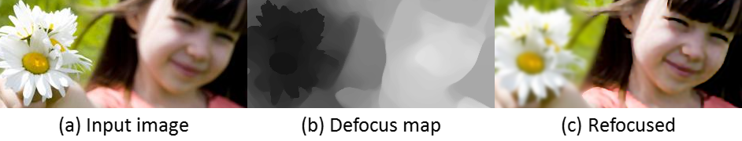
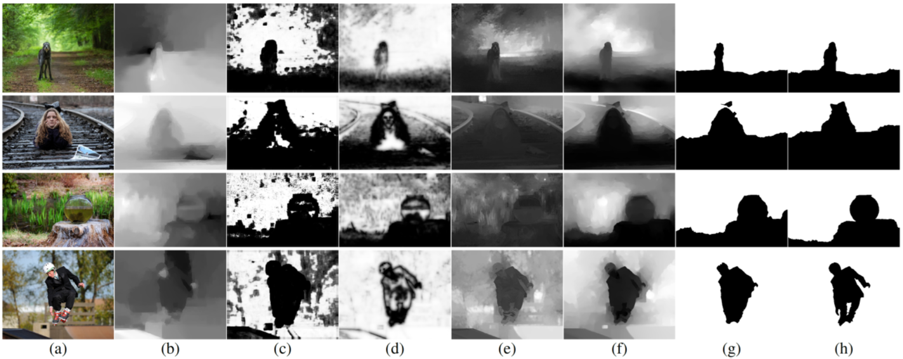

A Unified Approach of Multi-scale Deep and Hand-crafted Features for Defocus Estimation
----------
#### [Jinsun Park](https://sites.google.com/site/zzangjinsun/), Yu-Wing Tai, [Donghyeon Cho](https://sites.google.com/site/donghyeonchocvip/) and In So Kweon
#### _IEEE Conference on Computer Vision and Pattern Recognition (CVPR), Jul 2017_

### Introduction

In this paper, we introduce robust and synergetic hand-crafted features and a simple but efficient deep feature from a convolutional neural network (CNN) architecture for defocus estimation. This paper systematically analyzes the effectiveness of different features, and shows how each feature can compensate for the weaknesses of other features when they are concatenated. For a full defocus map estimation, we extract image patches on strong edges sparsely, after which we use them for deep and hand-crafted feature extraction. In order to reduce the degree of patch-scale dependency, we also propose a multi-scale patch extraction strategy. A sparse defocus map is generated using a neural network classifier followed by a probability-joint bilateral filter. The final defocus map is obtained from the sparse defocus map with guidance from an edge-preserving filtered input image. Experimental results show that our algorithm is superior to state-of-the-art algorithms in terms of defocus estimation. Our work can be used for applications such as segmentation, blur magnification, all-in-focus image generation, and 3-D estimation.

### Results

Defocus map estimation and binary blurry region segmentation results. (a) Input images. (b) Results of Shi et al. [1] (c) Results of Shi et al. [2] (d) Results of Shi et al. [3] (Inverted for visualization) (e) Results of Zhuo and Sim. [4] (f) Our defocus maps and (g) corresponding binary masks. (h) Ground truth binary masks.

### Citation

    @inproceedings{park2017unified,
        title={A Unified Approach of Multi-scale Deep and Hand-crafted Features for Defocus Estimation},
        author={Park, Jinsun and Tai, Yu-Wing and Cho, Donghyeon and Kweon, In So},
        booktitle={To appear in CVPR 2017},
        year={2017}
    }
    
### Dependencies
Our current implementation is tested on:
- Ubuntu 14.04.5 LTS (64-bit)
- [Caffe](http://caffe.berkeleyvision.org/) (Matcaffe)
- MATLAB R2016a / R2017a
- [OpenCV 2.4 / 3.0 / 3.2](http://opencv.org/)
- [Joint WMF](http://www.cse.cuhk.edu.hk/leojia/projects/fastwmedian/)
- [Rolling Guidance Filter](http://www.cse.cuhk.edu.hk/leojia/projects/rollguidance/)

### Usage
1. Training
    - Prepare training dataset. They should be placed individually under 'data/training/%04d'. For example, there are currently 3 images (from ImageNet [5]) in 'data/training/0001', 'data/training/0002', 'data/training/0003'.
 
    - Run 'DHDE_feature_extraction.m' for feature extraction. (Please adjust parameters adequately.) It will generate {dbDCT, dbGRD, dbSVD, dbIMG, log.txt} in each folder. 'log.txt' contains number of extracted features and elapsed time.
 
    - Run 'DHDE_db_generation.m' for train/validation db generation.
 
    - Create 'logs' and 'models' directory.
 
    - Run 'DHDE_train.sh' to start training. (Change TOOLS to your caffe path.) log files will be saved in 'logs' and snapshots will be saved in 'models'.
    
2. Defocus estimation
    - Run 'DHDE_compile_jointWMF.m' in 'subfunctions/JointWMF'. (Please adjust library path adequately.) It will generate 'mexJointWMF.mexa64' in the same folder.
    
    - Run 'DHDE_defocus_estimation.m'. (Please adjust parameters adequately.)
    
    - Outputs can be found in 'data/defocus/%04d/multiscale'.

### Notes
- External dependencies ([Joint WMF](http://www.cse.cuhk.edu.hk/leojia/projects/fastwmedian/) [6] and [Rolling Guidance Filter](http://www.cse.cuhk.edu.hk/leojia/projects/rollguidance/) [7]) are included for your convenience. They can be downloaded from their websites.

- Please carefully adjust library path for mex compilation of JointWMF.

- Test images are from [Blur Detection Dataset](http://www.cse.cuhk.edu.hk/leojia/projects/dblurdetect/dataset.html) [2].

### References

[1] Shi, Jianping, et al. "Break ames room illusion: depth from general single images." ACM Transactions on Graphics (TOG) 34.6 (2015): 225.

[2] Shi, Jianping, Li Xu, and Jiaya Jia. "Discriminative blur detection features." Proceedings of the IEEE Conference on Computer Vision and Pattern Recognition. 2014.

[3] Shi, Jianping, Li Xu, and Jiaya Jia. "Just noticeable defocus blur detection and estimation." Proceedings of the IEEE Conference on Computer Vision and Pattern Recognition. 2015.

[4] Zhuo, Shaojie, and Terence Sim. "Defocus map estimation from a single image." Pattern Recognition 44.9 (2011): 1852-1858.

[5] Russakovsky, Olga, et al. "Imagenet large scale visual recognition challenge." International Journal of Computer Vision 115.3 (2015): 211-252.

[6] Zhang, Qi, Li Xu, and Jiaya Jia. "100+ times faster weighted median filter (WMF)." Proceedings of the IEEE Conference on Computer Vision and Pattern Recognition. 2014.

[7] Zhang, Qi, et al. "Rolling guidance filter." European Conference on Computer Vision. Springer International Publishing, 2014.
